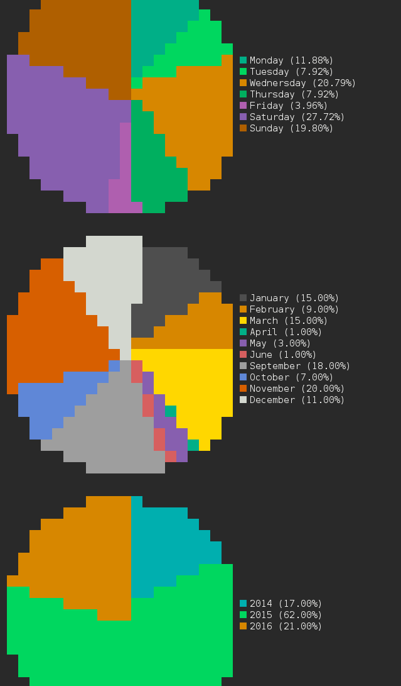

# learn-memory-statistics-cli

A CLI to see statistics from your Learn Memory server.

```bash
$ npm install -g learn-memory-statistics-cli
$ learnstats -u https://cedced19.github.io/learn-memory-static/data.json
```

